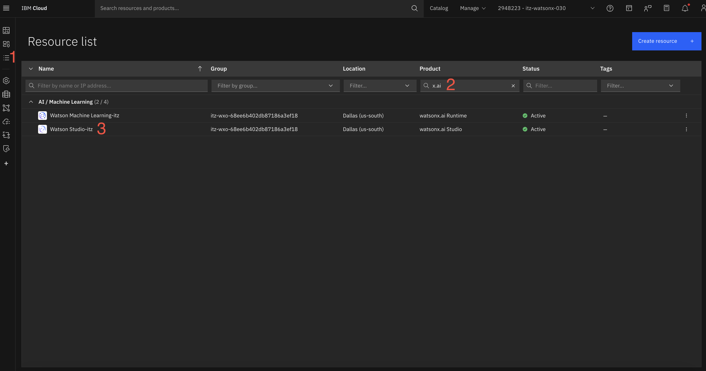
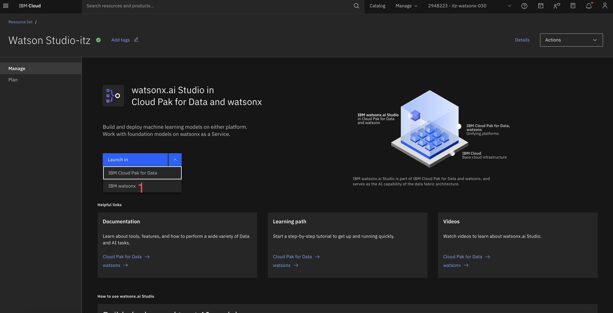
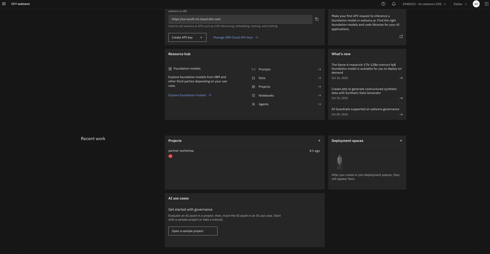
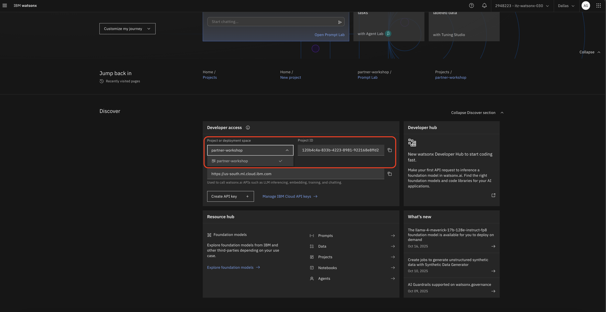
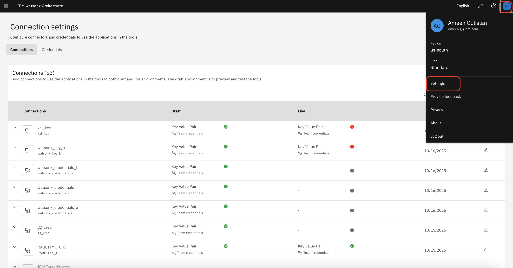
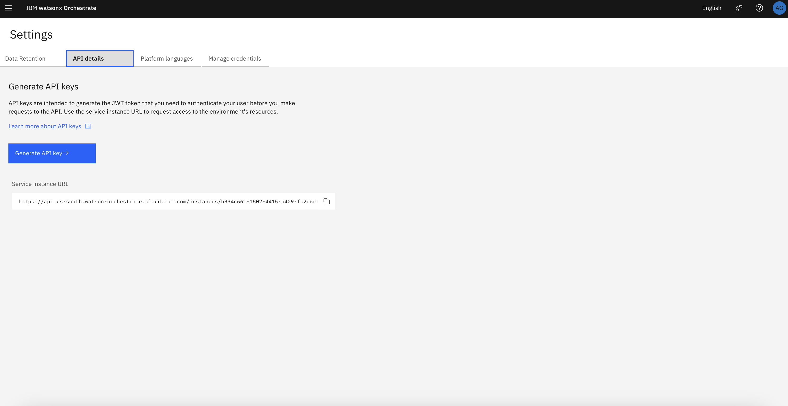
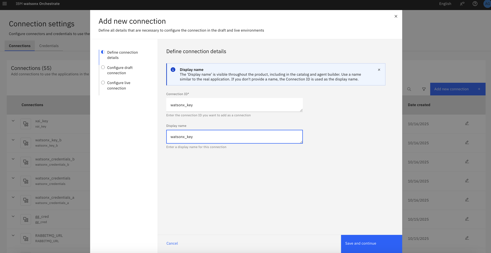
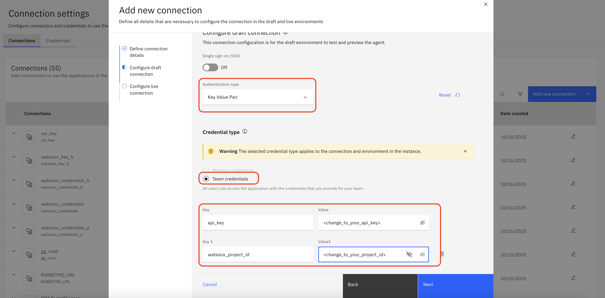

## AI Alliance Workshop

### 1. Setup IBM Cloud free trial version
1. Please access the following link:
https://www.ibm.com/products/watsonx-orchestrate and click on `Try it for free`


2. please fill in your email address can be personal email address and other information to register for watsonx Orchestrate


3. After registering you should get a code to your email.


4. Please add the code to register for free trial


5. Once registered please deploy the trial in `us-east` region


6. You will be directed to: https://dl.watson-orchestrate.ibm.com/. Afterwards please, login with the IBMid and password you signed up with.


7. Your instance have been successfully provisioned once you landed here.


### 2. Setup watsonx.ai


1. On your IBM Cloud page. Go to watsonx.ai click 'resource list' as in no.1 of above image. Search for 'x.ai' and click on studio.



2. Click "Launch in" then click "IBM watsonx".



3. On projects Click "+" sign and create your project.


4. After created the project. Go to "Manage" tab. Click "Services & Integrations". Click "Associate Service" then add only Machine Learning service you have.



5. Go back to main page. On the Developer Access part. Click project you just create and save "Project ID" on your note.


### 3. Setup forward port in VSCode
- Miew help capture screen noi, please. 

### 4. Provision MCP server
1. run this command `uvx --from docling-mcp docling-mcp-server --transport sse` in your terminal
2. Forward port of application in step 4.1 (should be 8000)

### 5. Setup Critic Agent on Langflow


1. Go to Langflow. If you never start it, do with command `docker run -p 7860:7860 langflowai/langflow:latest`


2. Import project with the given JSON file (Workshop Flow.json)
3. In the flow chage the model to the provider you have API key, and input your API key (can replicate from previous workshop where you can use ChatGPT).
4. Forward port of this application (should be 7860)

### 6. Setup Master Agent and Docling Agent on watsonx Orchestrate

0. run `cd orchestrate` and `pip install uv` then `uv sync`


1. Launch watsonx Orchestrate. Go to resource list of IBM Cloud and search for "orchestrate". 



2. Click on the resource and Click "Launch watsonx Orchestrate".



3. Go to profile on top right and click "Settings". Click "Generate API Key". You will save this API key to use later.




4. Click on Hamburger bar on top left. Click "Manage" and "Connections". Add the Connection with same setting as images above (ID and name should be `watsonx_key`). Click on "Connect" and then click "Next". Click "Paste draft configuration" then "Add connection".

5. On your terminal run `orchestrate models add --name "watsonx/openai/gpt-oss-120b" --app-id watsonx_key`

6. Import agent with command `orchestrate agents import -f orchestrate/agents/docling_agent.yml` and `orchestrate agents import -f orchestrate/agents/master_agent.yml`


7. Go to "docling_agent" on watsonx Orchestrate. Click "Add tool". Click "Add from file or MCP server". Click "Import from MCP server". Click "Add MCP server".

8. Put service name as "docling_mcp". Put the command `uvx mcp-proxy <forwarded_address_of_docling_mcp>/sse`. Leave other fields as it is. Click "Connect" and "Done". Toggle open for all tools you see on the screen, all pages.


9. Go to master_agent. Click "Add agent". Click "Import from local instance". Click "docling_agent" then "Add to agent".


10. Go to Langflow project you imported. Click "Share" and select "MCP Server". Copy the url as shown on the 2nd image and save it on your note. 

11. Go to Toolset of master_agent. Now, we will add critic_agent of Langflow via MCP. Again, you will click on "Add tool", "Add from file or MCP server", and "Import from MCP server". Click "Add MCP server". Put "Server name" as `langflow`. Replace URL you copy from step 10 from (http://localhost:7860) with (Your forwarded address of port 7860). Put "Install command" as `uvx mcp-proxy <Your fixed url>`. Click "Connect" and "Done". Toggle open for all tools you see on the screen, all pages. 

### 7. Test master_agent
```
Q1: Create this docling document: https://www.infineuminsight.com/media/2601/emea-fundamentals-of-engine-design-and-operation.pdf
```
```
Q2: what are Hybridisation of diesel future engine?
A2: Slide 32
```
```
Q3: How Generic Euro VI Diesel After-treatment Technology work?
A3: Slide 13
```
```
Q4: Different injection configurations
A4: Slide 22
```
```
Q5: What should I add on the document to make it better.
A5: <No reference should forward to Langflow>
```


