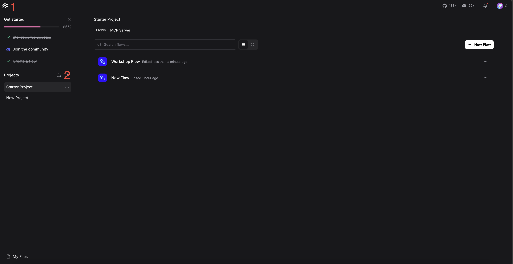
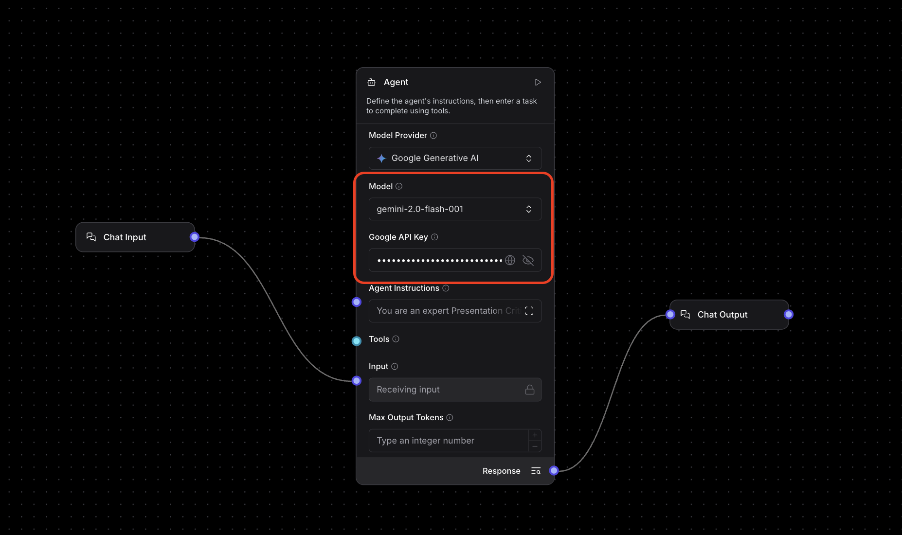
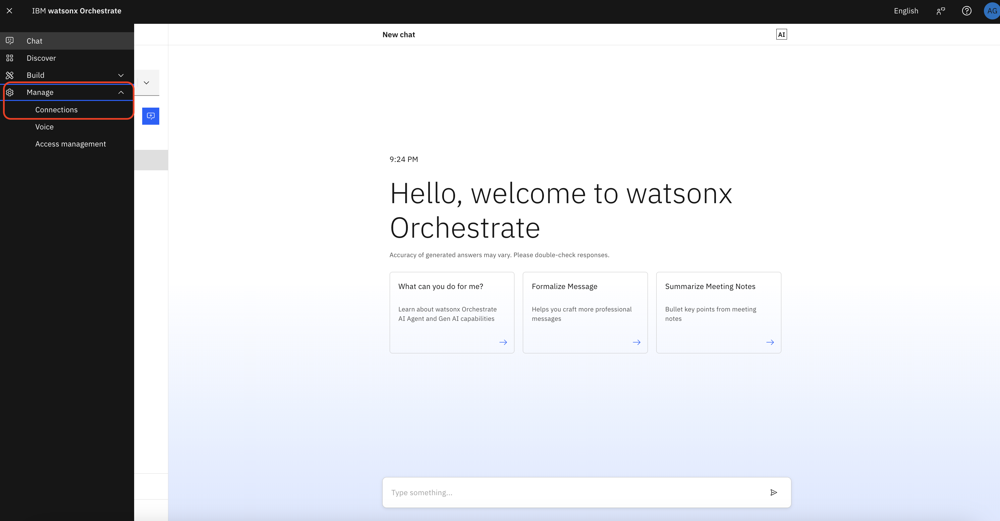
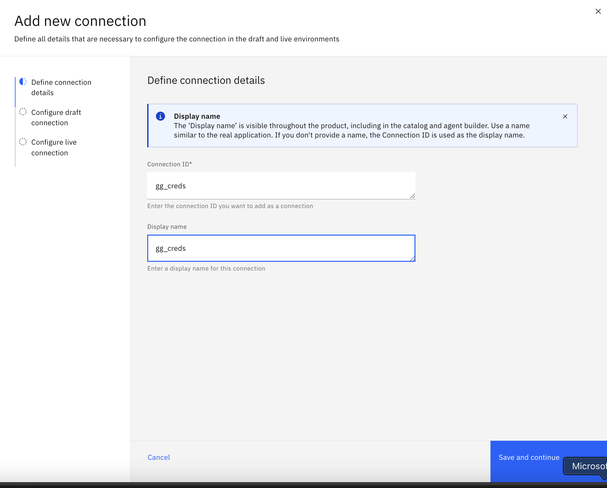
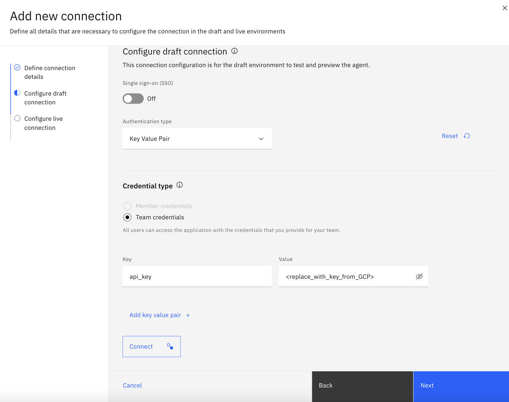
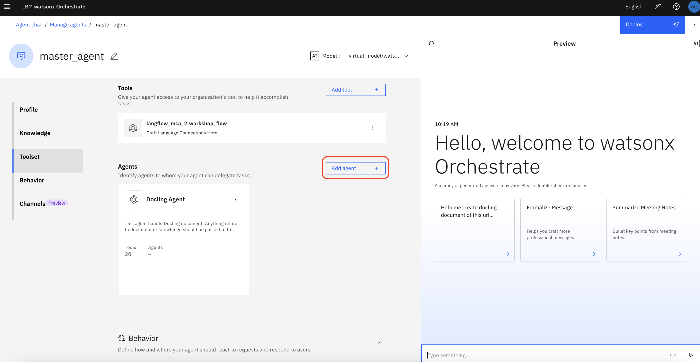
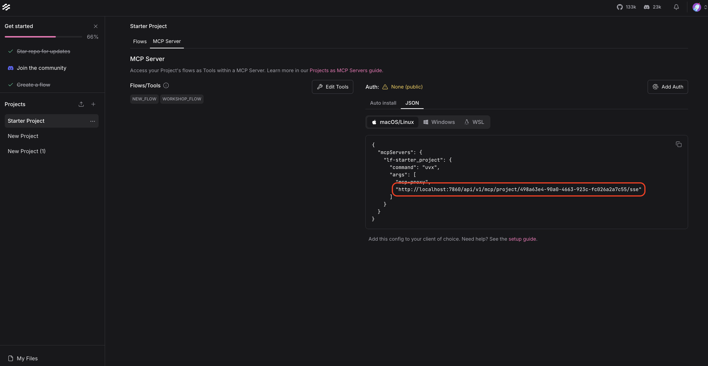

## AI Alliance Workshop

### 1. Setup IBM Cloud free trial version
1. Please access the following link:
https://www.ibm.com/products/watsonx-orchestrate and click on `Try it for free`


2. please fill in your email address can be personal email address and other information to register for watsonx Orchestrate


3. After registering you should get a code to your email.


4. Please add the code to register for free trial


5. Once registered please deploy the trial in `us-east` region


6. You will be directed to: https://dl.watson-orchestrate.ibm.com/. Afterwards please, login with the IBMid and password you signed up with.


7. Your instance have been successfully provisioned once you landed here.


### 2. Add Gemini
4. Our goal is to add `google/gemini-2.5-flash` to watsonx Orchestrate. Please visit https://aistudio.google.com and click generate an API key to get your API key.


NOTE:
If you are unable to create api key, it means you haven't enabled Gemini API in Google cloud console and created a project. Hence please, enable gemini API and create a project.


Enabling Gemini API

Creating Project


### 3. Setup forward port
1. Go to https://ngrok.com/download/windows?tab=download register and install. Only if you does not have Ngrok installed yet.
(Required only non-installed Ngrok)
2. Run `ngrok config edit`
3. Replace this block of code to the YML file
```
version: 3
agent:
  authtoken: <your-authtoken>

tunnels:
  web:
    addr: 7680
    proto: http
  api:
    addr: 8000
    proto: http
```
4. Run `ngrok start --all`

### 4. Provision MCP server
0. If you never install uv, please run `pip install uv`
1. run this command `uvx --from docling-mcp docling-mcp-server --transport sse` in your terminal
2. Forward port of application in step 4.1 (should be 8000)

### 5. Setup Critic Agent on Langflow



1. Go to Langflow. If you never start it, do with command `docker run -p 7860:7860 langflowai/langflow:latest`



2. Import project with the given JSON file (Workshop Flow.json)
3. In the flow chage the model to the provider you have API key, and input your API key (can replicate from previous workshop where you can use ChatGPT).
4. Forward port of this application (should be 7860)

### 6. Setup Master Agent and Docling Agent on watsonx Orchestrate

0. run `cd orchestrate` then `uv sync`
- For windows, run `.\.venv\Scripts\activate.bat`. For macOS, `source .venv/bin/activate`.



1.Go to watsonx Orchestrate connections




2. Click on Hamburger bar on top left. Click "Manage" and "Connections". Add the Connection with same setting as images above (ID and name should be `gg_creds`). Click on "Connect" and then click "Next". Click "Paste draft configuration" then "Add connection".

3. Setup WxO instance
3.1 Go to profile on the top-right. Click "Settings" and select tab "API details". Save the "Service instance URL" with you. Also, Click "Generate your API key" and save it on your note.
3.2 Back to VSCode where you ran cd to orchestrate. Run `orchestrate env add -n workshop-ai -u <Your Service instance URL>` and run `orchestrate env activate workshop-ai` then paste your saved API key.

5. On your terminal run `orchestrate models add --name "google/gemini-2.5-flash" --app-id gg_creds`

6. Import agent with command `orchestrate agents import -f orchestrate/agents/docling_agent.yml` and `orchestrate agents import -f orchestrate/agents/master_agent.yml`


6. Go to "docling_agent" on watsonx Orchestrate. Click "Add tool". Click "Add from file or MCP server". Click "Import from MCP server". Click "Add MCP server".

7. Put service name as "docling_mcp". Put the command `uvx mcp-proxy <forwarded_address_of_docling_mcp(port 8000)>/sse`. Leave other fields as it is. Click "Connect" and "Done". Toggle open for all tools you see on the screen, all pages.



8. Go to master_agent. Click "Add agent". Click "Import from local instance". Click "docling_agent" then "Add to agent".




9. Go to Langflow project you imported. Click "Share" and select "MCP Server". Copy the url as shown on the 2nd image and save it on your note. 

10. Go to Toolset of master_agent. Now, we will add critic_agent of Langflow via MCP. Again, you will click on "Add tool", "Add from file or MCP server", and "Import from MCP server". Click "Add MCP server". Put "Server name" as `langflow`. Replace URL you copy from step 10 from (http://localhost:7860) with (Your forwarded address of port 7860). Put "Install command" as `uvx mcp-proxy <Your fixed url>`. Click "Connect" and "Done". Toggle open for all tools you see on the screen, all pages. 

### 7. Test master_agent
```
Q1: Create this docling document: https://www.infineuminsight.com/media/2601/emea-fundamentals-of-engine-design-and-operation.pdf
```
```
Q2: what is the Hybridisation of diesel future engine?
A2: Slide 32 (Mild Hybrid...)
```
```
Q3: I think it should be moderate hybrid. Please update the document.
A3: Slide 22
```
```
Q4: What should I add on the document to make it better.
A4: <No reference should forward to Langflow>
```
```
Q5: with this doc key <replace>. Help me find answer what are Hybridisation of diesel future engine?
A5: should be moderate hybrid
```


